<div align="center">

# DIKSHANT CHAUHAN

### `Java Backend Developer`

**Java • Spring Boot • REST APIs • PostgreSQL • Docker • AI**

<br>

```text
┌──────────────────────────────────────────────────────────────────┐
│                                                                  │
│  dikshant@github:~$ whoami                                      │
│                                                                  │
│  Java Backend Developer                                          │
│  Building practical backend systems with Java & Spring Boot     │
│                                                                  │
│  dikshant@github:~$ echo "build • learn • solve • repeat"       │
│                                                                  │
└──────────────────────────────────────────────────────────────────┘
```

<br>

## `dikshant@github:~$ ./contributions.sh`



<br><br>

## `dikshant@github:~$ neofetch`

<table>
<tr>
<td width="45%" align="center" valign="middle">


</td>

<td width="55%" align="left" valign="middle">

```text
┌──────────────────────────────────────┐
│        dikshant@github               │
│        ─────────────────             │
│                                      │
│  NAME       Dikshant Chauhan         │
│  ROLE       Backend Developer        │
│  LANGUAGE   Java                     │
│  FRAMEWORK  Spring Boot              │
│  API        REST APIs                │
│  DATABASE   PostgreSQL • MySQL      │
│  AI         RAG • Gemini             │
│  TOOLS      Git • Docker • Postman  │
│                                      │
│  STATUS     Building & Learning      │
└──────────────────────────────────────┘
```

</td>
</tr>
</table>

<br>

## `dikshant@github:~$ ./tech-stack.sh`



<br>

### Languages

`Java` `Python` `JavaScript` `C`

### Backend

`Spring Boot` `Spring Data JPA` `Hibernate` `REST APIs`

### Frontend

`React.js` `HTML5` `CSS3` `Tailwind CSS`

### Database

`PostgreSQL` `MySQL` `pgvector`

### AI

`RAG` `Google Gemini API` `AI Integration`

### Tools

`Git` `GitHub` `Docker` `Postman` `IntelliJ IDEA` `VS Code`

<br>

## `dikshant@github:~$ ls ./projects`

<table>
<tr>

<td width="33%" valign="top">

### CodeSphere

**Online IDE**

React + Spring Boot + Docker + Gemini AI

</td>

<td width="33%" valign="top">

### DocMind

**AI Document Intelligence**

RAG + PostgreSQL + pgvector

</td>

<td width="33%" valign="top">

### Student REST API

**Backend REST API**

Spring Boot + JPA + MySQL

</td>

</tr>
</table>

<br>

## `dikshant@github:~$ ./current-focus.sh`

```text
> Java & Spring Boot
> Backend Development
> Data Structures & Algorithms
> AI / RAG
> System Design
```

<br>

## `dikshant@github:~$ cat about.txt`

I'm a **Java Backend Developer** focused on building practical applications with **Java and Spring Boot**.

I enjoy working with REST APIs, databases, Docker and AI-powered applications.  
Currently improving my backend development, DSA and system design skills.

<br>

## `dikshant@github:~$ connect`

<a href="https://github.com/DkRajput25">
  
</a>

<br><br>

```text
┌──────────────────────────────────────────────────────────────────┐
│                                                                  │
│  dikshant@github:~$ ./life.sh                                  │
│                                                                  │
│  > build                                                         │
│  > learn                                                         │
│  > solve                                                         │
│  > repeat                                                        │
│                                                                  │
└──────────────────────────────────────────────────────────────────┘
```

<br>

<sub>Designed like a terminal • Built like a developer</sub>

</div>