<div align="center">

# `Dikshant Chauhan`

```text
┌──────────────────────────────────────────────────────────────┐
│                                                              │
│  dikshant@github:~$ whoami                                  │
│                                                              │
│  > Java Backend Developer                                   │
│  > Spring Boot • REST APIs • React • AI                     │
│                                                              │
│  dikshant@github:~$ echo "build. learn. solve. repeat."     │
│                                                              │
└──────────────────────────────────────────────────────────────┘
```

<h3><code>dikshant@github:~$ ./contributions.sh</code></h3>


<br><br>

<h3><code>dikshant@github:~$ neofetch</code></h3>

<table>
<tr>
<td width="42%" valign="middle" align="center">


</td>

<td width="58%" valign="middle">



</td>
</tr>
</table>

<br>

<h3><code>dikshant@github:~$ cat about.txt</code></h3>

```text
┌──────────────────────────────────────────────────────────────┐
│                                                              │
│  Java Backend Developer focused on building practical        │
│  applications with Java and Spring Boot.                    │
│                                                              │
│  I work with REST APIs, databases, React and AI-powered      │
│  applications.                                               │
│                                                              │
│  Currently improving my backend development, DSA and         │
│  system design skills.                                       │
│                                                              │
└──────────────────────────────────────────────────────────────┘
```

<br>

<h3><code>dikshant@github:~$ cat tech-stack.txt</code></h3>

```text
LANGUAGES
Java • Python • JavaScript • C

BACKEND
Spring Boot • Spring Data JPA • Hibernate • REST APIs

FRONTEND
React.js • HTML5 • CSS3 • Tailwind CSS

DATABASE
MySQL • PostgreSQL • pgvector

AI
RAG • Google Gemini API • AI Integration

TOOLS
Git • GitHub • Docker • Postman • IntelliJ IDEA • VS Code
```

<br>

<h3><code>dikshant@github:~$ ls ./projects</code></h3>

```text
01  CodeSphere
    Online IDE • React • Spring Boot • Docker • Gemini AI

02  DocMind
    AI Document Intelligence • RAG • PostgreSQL • pgvector

03  Student REST API
    Spring Boot • REST API • JPA • MySQL
```

<br>

<h3><code>dikshant@github:~$ ./current-focus.sh</code></h3>

```text
> Java & Spring Boot
> Backend Development
> Data Structures & Algorithms
> AI / RAG
> System Design
```

<br>

<h3><code>dikshant@github:~$ connect</code></h3>

<a href="https://github.com/DkRajput25">
  GitHub
</a>

<br><br>

```text
┌──────────────────────────────────────────────────────────────┐
│                                                              │
│  dikshant@github:~$ ./life.sh                               │
│                                                              │
│  > build                                                     │
│  > learn                                                     │
│  > solve                                                     │
│  > repeat                                                    │
│                                                              │
└──────────────────────────────────────────────────────────────┘
```

<br>

<sub>Designed like a terminal. Built like a developer.</sub>

</div>
